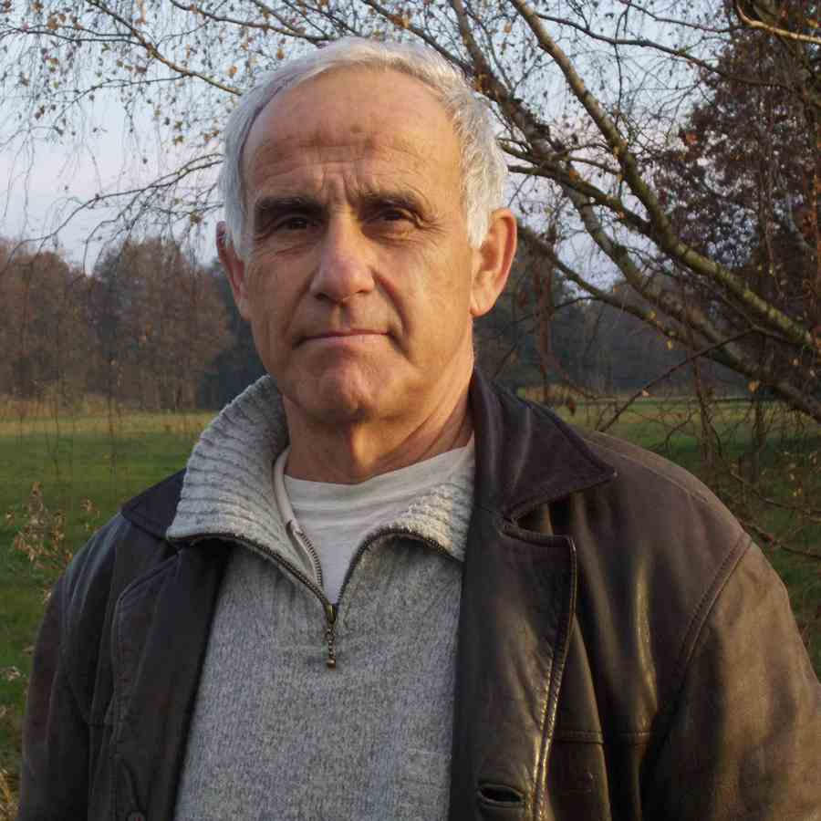

# Dr. Klaus-Peter Pleissner  

Bioinformatician (retired, born 1944)    
E-mail: pleissner@gmail.com  
City: Berlin/Germany  

***

### My scientific interests:

* www-accessible 2-dimensional (2-DE) gel electrophoresis databases  
 
* image analysis of 2-DE gels  

* software development for high-throughput RNAi screens  

* statistical analysis of biological/genetic/proteomic data  

* programming skills: R, Perl, HTML, FORTRAN,  relational databases (MySQL, PostGres)  

*** 
### My publications:  

* **Not-cited in PubMed:**  <a href="https://sites.google.com/site/pleissner/home/publications " target="_blank"> publications</a> 
* **Cited in PubMed:**  <a href="http://www.ncbi.nlm.nih.gov/pubmed/?term=pleissner+kp" target="_blank"> publications</a> 

***  

### Some contributions to WWW:
* <a href="http://www.chemie.fu-berlin.de/user/pleiss/ " target="_blank">   The Human Myocardial 2D Gel Protein Database </a>  

* <a href="http://www.mpiib-berlin.mpg.de/2D-PAGE/" target="_blank">   Proteome Database System for Microbial Research </a> 

* <a href="https://grippe.shinyapps.io/CA_plot/ " target="_blank">   Interactive Correspondence Analysis plot </a>  

* <a href="https://grippe.shinyapps.io/VIRTUAL-2DE-revised/ " target="_blank">   Virtual 2-D gel electrophoresis plot</a> 

* <a href="https://grippe.shinyapps.io/HELAPRO/" target="_blank">   Virtual 2-D gel electrophoresis plot of Hela cells</a> 

*** 

### My working places:  

* Central Institute for Molecular Biology, Berlin (1970-1991)  

* Sued Laborbedarf GmbH, Gauting/Munich (1991-1992)  

* German Heart Institute, Berlin (1992-1998)  

* Institute of Plant Genetics and Crop Plant Research, Gatersleben (1998-2001)  

* Max Planck Institute for Infection Biology (2001-2009)  

*** 
### My hobbies:  
tennis, skiing, hiking, choir-sing, church-music (Cantorei der Reformationskirche: <http://www.cantorei.de/>)

